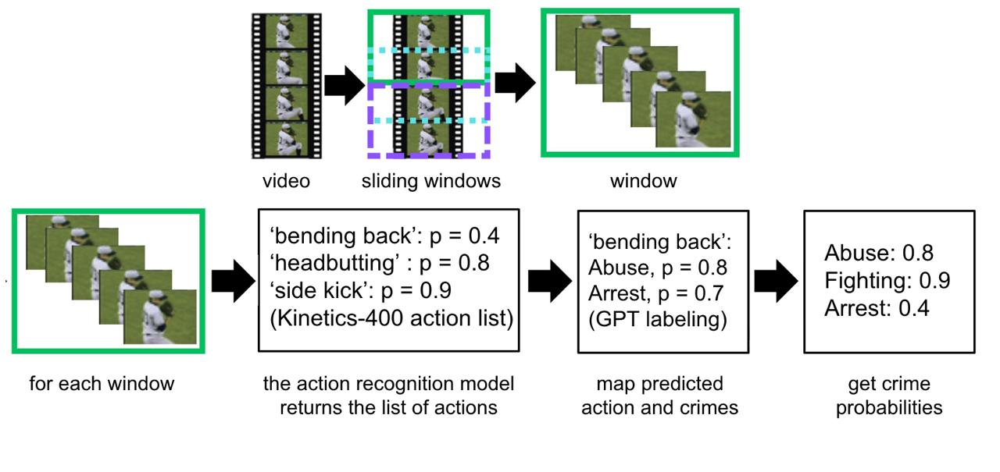
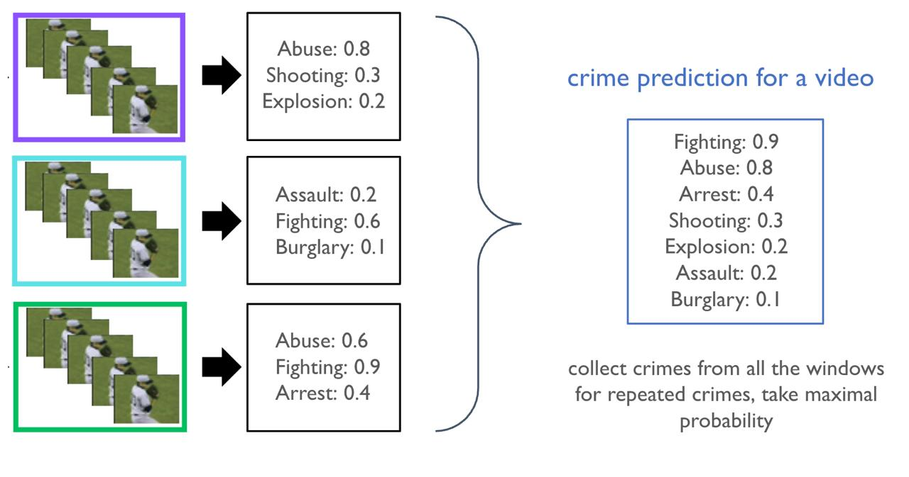
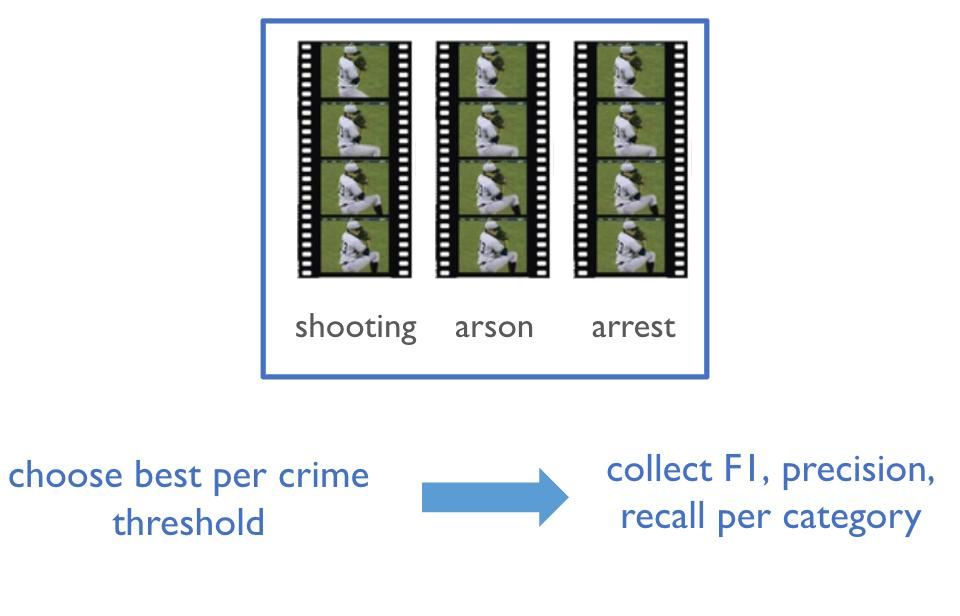
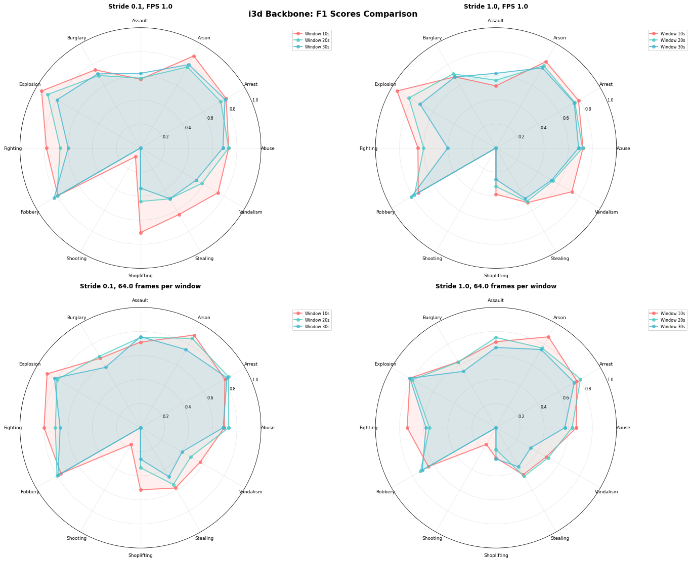

# Video Crime Classification Baseline

A modular pipeline for video crime classification on the UCF-Crime dataset using action detection models. The approach extracts actions from video segments using pre-trained action recognition models (R3D-18, I3D) and maps detected actions to crime probabilities through learned mappings.

<p align="center">
  <a href="https://drive.google.com/file/d/1ZJ0NW0dQYrHmP2QXgE5h_EqUithsq5h7/view?usp=drive_link"><b>📄 Poster (PDF)</b></a>
  &nbsp;&nbsp;&nbsp;&nbsp;
  <a href="https://docs.google.com/presentation/d/1Gtc5C2fc2_ATJAXoAJmrAKTo7czL1FLNXGH-BfA9k5M/edit?usp=drive_link"><b>📊 Presentation (PDF)</b></a>
</p>

|                     |                     |                     |
|:-------------------:|:-------------------:|:-------------------:|
|  |  |  |
| **⬇️**<br>**Burglary**    | **⬇️**<br>**Road Accident**    | **⬇️**<br>**Abuse**    |

## Approach

This baseline implements a **sliding window + action detection** approach:

1. **Video Segmentation**: Videos are processed using sliding windows (configurable size/stride)
2. **Action Detection**: Each window is fed through action recognition models (Kinetics-400 trained)
3. **Action-to-Crime Mapping**: Detected actions are mapped to crime probabilities using pre-defined mappings
4. **Aggregation**: Window-level predictions are aggregated to video-level crime scores
5. **Threshold Tuning**: Per-class thresholds are optimized for final classification

The pipeline supports both serial and batched processing, with optional CUDA acceleration and mixed precision training.

<div align="center">
  
  <p style="text-align: center;">Video Segmentation + Action Detection</p>
</div>

<div align="center">
  
  <p style="text-align: center;">Action-to-Crime Mapping + Aggregation</p>
</div>

<div align="center">
  
  <p style="text-align: center;">Threshold-tuning + metrics collection</p>
</div>

## Quick start

- Show active config:
```bash
python -m pipelines.crime_pipeline config
```

- Apply action detection models and compute crime probabilities:
```bash
python -m pipelines.crime_pipeline scores videos/selected_videos.json
```
>Depending on how you process the video (by specifying the number of model frames per second, or fps), the path to the scores is automatically determined as 
>
>```bash
>results/crimes/{dataset_tag}/{backbone}/(model_frames|fps)/runs/
>      - if model_frames > 0 → subdir 'model_frames/runs', filename: window_{ws}_stride_{sp}.json
>      - else → subdir 'fps/runs', filename: window_{ws}_stride_{sp}_fps_{target_fps}.json
>```

- Tune per-class thresholds to maximize F1-score:
```bash
python -m pipelines.crime_pipeline tune <PATH_TO_SCORES_CSV>
```

>Depending on how you process the video (by specifying the number of model frames per second, or fps), the path to the thresholds is automatically determined as 
>
>```bash
>thresholds/{dataset_tag}/{backbone}/(model_frames|fps)/
>      - if model_frames > 0 → thresholds_window_{ws}_stride_{sp}.json
>      - else → thresholds_window_{ws}_stride_{sp}_fps_{target_fps}.json
>```

- Evaluate metrics using tuned thresholds:
```bash
python -m pipelines.crime_pipeline eval <PATH_TO_SCORES_CSV> <PATH_TO_THRESHOLDS_JSON>
```

- Optional: process a single video (debug):
```bash
python -m core.runner /abs/path/to/video.mp4 \
  --config_path config.json \
  --window_size 2.0 --stride_percent 0.5 --target_fps 1.6 --aggregation_method max
```

## Results
<div align="center">
  
  <p style="text-align: center;">Configuration comparison; best overall F1: 0.704</p>
</div>

<div align="center">

<table>
  <tr>
    <td align="center">
      <br>
      <sub><b>F1 for best configuration</b></sub>
    </td>
    <td align="center">
      <br>
      <sub><b>Precision &amp; Recall for maximum F1 configuration</b></sub>
    </td>
  </tr>
</table>

</div>


## Dataset Setup

### Video Structure
Place your videos in the directory specified by `videos_base_path` in `config.json`. The expected structure is:

```
{videos_base_path}/
├── Abuse/
│   ├── Abuse001_x264.mp4
│   ├── Abuse002_x264.mp4
│   └── ...
├── Arson/
│   ├── Arson001_x264.mp4
│   ├── Arson002_x264.mp4
│   └── ...
├── Fighting/
│   ├── Fighting001_x264.mp4
│   ├── Fighting002_x264.mp4
│   └── ...
├── Normal/
│   ├── Normal_Videos_001_x264.mp4
│   ├── Normal_Videos_002_x264.mp4
│   └── ...
├── Shooting/
│   ├── Shooting001_x264.mp4
│   ├── Shooting002_x264.mp4
│   └── ...
└── ...
```

### Dataset JSON
The project includes a pre-configured `videos/selected_videos.json` file containing a selection from UCF-Crime dataset: 20 videos from each crime category plus 20 normal videos. If you want to use your own dataset, create a JSON file with this structure:

```json
[
  {
    "video_path": "Abuse/Abuse001_x264.mp4",
    "label": "Abuse"
  },
  {
    "video_path": "Normal/Normal_Videos_001_x264.mp4", 
    "label": "Normal"
  }
]
```

**Note**: Video paths in the JSON should be relative to `videos_base_path`, not absolute paths.

## Config
`config.json` is organized by typed sections and is backward‑compatible with the previous flat format.

```json
{
  "paths": {
    "crime_mapping_path": "mappings/kinetics400_crimes.json",
    "videos_base_path": "/path/to/your/videos/dataset"
  },
  "runtime": {
    "window_size": 30.0,
    "stride_percent": 1.0,
    "target_fps": 1.0,
    "backbone": "r3d18",
    "model_frames": 0,
    "use_batched": true,
    "batch_size": 16,
    "num_workers": 4,
    "prefetch_factor": 2,
    "amp_enabled": true,
    "default_threshold": 0.5
  },
  "tuning": {
    "thr_min": 0.0,
    "thr_max": 1.0,
    "thr_steps": 201
  }
}
```

Notes:
- `runtime.model_frames = 0` means derive frames per window from `window_size * target_fps`.
- `amp_enabled` enables CUDA AMP when available.

## Outputs and paths
Outputs are grouped by dataset tag (derived from the input JSON/CSV basename) and backbone.

- Scores CSV:
```
results/crimes/scores/{dataset_tag}/{backbone}/fps/
  window_{window_size}_stride_{stride_percent}_fps_{target_fps}.csv
```

- Tuned thresholds JSON:
```
thresholds/{dataset_tag}/{backbone}/fps/
  thresholds_window_{window_size}_stride_{stride_percent}_fps_{target_fps}.json
```

- Evaluation results JSON:
```
results/crimes/runs/{dataset_tag}/{backbone}/fps/
  results_window_{window_size}_stride_{stride_percent}_fps_{target_fps}.json
```

## Project layout
```
core/
  runner.py              # per‑video processing (serial/batched)
  video_processor.py     # frame extraction + sliding windows
pipelines/
  crime_pipeline.py      # scores/tune/eval CLI and orchestration
utils/
  metrics.py             # AUC/precision/recall, threshold sweep
  io.py                  # CSV/JSON I/O helpers
  paths.py               # path builders + dataset tag
  runner_utils.py        # device/AMP, mapping, stride/frames, aggregation
  scoring.py             # dataset scoring loop
models.py                # load_backbone(backbone, device)
config.json              # config (paths/runtime/tuning)
```

## Requirements
- Python 3.9+
- PyTorch, TorchVision, NumPy, scikit‑learn, OpenCV

If running on GPU, ensure CUDA build of PyTorch is installed.
